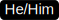

   <h1>Hi there, I'm <a href="http://princemakavana61.c1.biz/">Prince</a>  </h1>
   
   
    

   &nbsp;&nbsp;
&nbsp;&nbsp;
&nbsp;&nbsp;
&nbsp;&nbsp;
 &nbsp;&nbsp;
 &nbsp;&nbsp;
 &nbsp;&nbsp;
 

 <h5 align="center">
   <i>⚡️I am not perfect but I am best ⚡️</i>
  </h5>

### About Me

- 💼 SDE at [Simform](https://www.simform.com/)

- 📈 Currently, I am in the Computer Engineering at GEC-Rajkot. Mostly I am a hard worker, always ready to accept challenges

- I do fullstack and a bit of everything ❤️  All About living life at its best.

- 💬 Ask me about anything [here](https://github.com/PrinceMakavana/PrinceMakavana/issues)

<h2 align="center">⚡ Stats ⚡</h2>
 

  

    
    
  

           
  

      
  

 
 

### - Languages and Tools...

  <!-- For more icons please follow  https://github.com/MikeCodesDotNET/ColoredBadges -->
      
  
  
  
  
  
  
  
  
  
  
  
   
  
   
  
  
  
  

### Environments I work with:

<code></code>
<code></code>
<code></code>
<code></code>
<code></code>
<code></code>
<code></code>

  

 

<h2 align="center">🤝 Support</h2>

🎀 Contributions (<a href="https://guides.github.com/introduction/flow" title="GitHub flow">GitHub Flow</a>), 🔥 issues, and 🥮 feature requests are most welcome!

💙 If you like my projects, Give them ⭐ and Share it with friends!

Made with ❤️ in India

<h1 align='center'>⚡️<i>Stay awesome!</i>⚡️</h1>

        

